# 汇流（ESIP）一期整体架构设计方案与技术选型 v2

> 文档属性：一期立项配套的整体架构与技术选型，含整体/模块架构图。
> 输入基线：`一期设计基线_交换闭环立项版_v1.md`（含 Boss 判决 B/A/B/C）。
> 目标：把已冻结的范围、纯通道、降级、鉴权透传等决策落到可执行的架构图上，为模块细化详设提供骨架。

---

## 1. 架构总体视图（L0）

一期只交付"交换闭环"最小产品，全部能力收敛在 7 个独立部署单元内。架构按**控制面 / 数据面 / 审计面**三层组织，三层之间只通过事件与版本化元数据契约耦合，**不共享任何库表**。

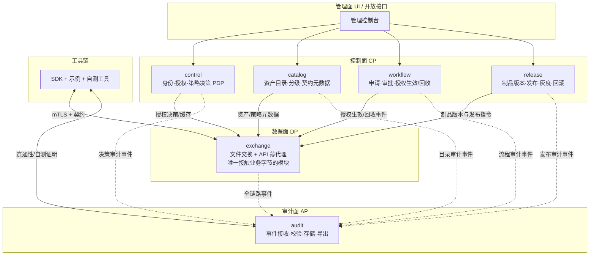

**分层职责**：

| 层 | 职责 | 关键约束 |
|---|---|---|
| 控制面 | 回答"谁能做什么、资产是什么、什么时候生效/回收" | 服务端策略校验是唯一权威；管理面不提供策略表达式编辑 |
| 数据面 | 唯一接触业务字节：接收—暂存—交付—到期删除；API 薄代理 | 纯通道、不落业务副本；exchange 可独立扩缩/升级/回滚 |
| 审计面 | 接收全链路事件，缺失强制字段即拒绝 | WAL → 异步补写；按密级 fail-open/fail-closed 分叉 |
| 接入工具链 | SDK、示例、自测工具 | 与 exchange 同批交付；自测闸门是接入人天承诺前提 |

---

## 2. 部署拓扑（跨网段、网络管制环境）

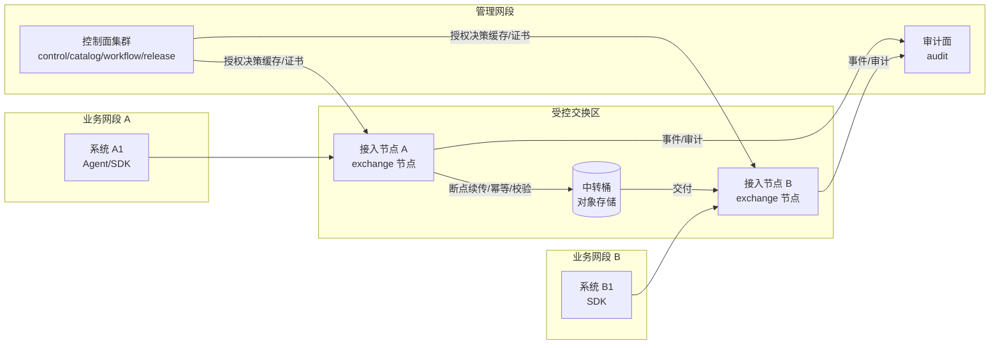

**部署要点**：

1. **接入节点（exchange）部署在受控交换区**，是网络管制下唯一可放行的服务；业务网段只开放到接入节点的放行策略，由客户网络团队管控（首网段 +3–5 人天对应此流程）。
2. **控制面/审计面部署在管理网段**，不与业务网段直连；exchange 与 CP 之间仅走"已缓存且未过期的授权决策"，CP 故障不影响在途传输。
3. **中转桶（对象存储）是平台唯一落业务字节的地方**，仅执行接收—暂存—交付—到期删除，无检索/浏览/派生接口。
4. 所有模块间通信用 mTLS，证书链可对接客户现有 CA 或平台内置 CA（国密算法能力预留，PoC 期间与安全部会签）。

---

## 3. 模块架构（L1）

### 3.1 control（身份·授权·策略决策 PDP）

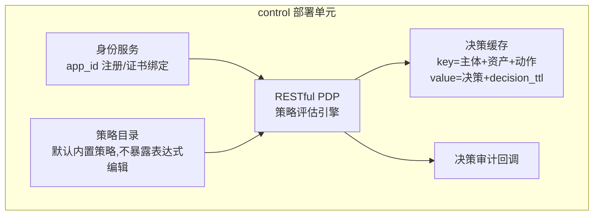

- 唯一权威：服务端 PDP 决策；`source_ip + client_certificate + app_id` 绑定应用身份；`human_actor_required` 头校验在 PDP 内完成。
- 降级 L1：PDP 短暂不可用时只用未过期缓存决策，严格 `decision_ttl`，不扩大权限。
- 五类能力（发现/申请/调用/看全量/再分发）在策略模型中分开建模，策略主体是**应用**不是人。

### 3.2 catalog（资产目录）

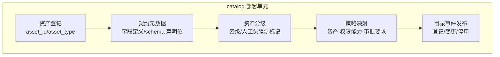

- 元数据包含 `human_actor_required`（Boss 判决 A 的落地载体）、可选 `schema` 声明位（为三期落湖预留）。
- 资产登记、变更均发事件，供 audit、workflow、exchange 消费；不暴露业务数据。

### 3.3 workflow（申请·审批·授权生命周期）

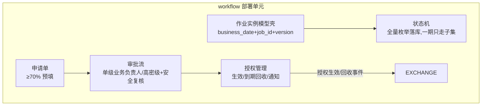

- 授权 10 分钟内生效、到期自动回收并通知；不提供策略表达式编辑入口。
- 调度只保留实例模型壳（状态/触发源枚举全量落库），一期仅手动+定时触发。

### 3.4 exchange（数据面核心，唯一接触业务字节）

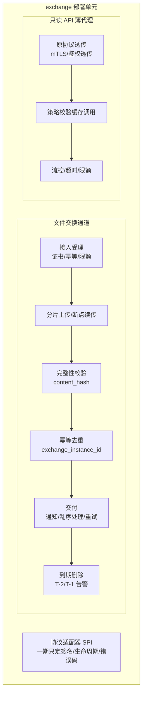

- 文件通道：接收—暂存—交付—到期删除；断点续传、零重复入账、断网重连零重传错误。
- API 通道：原协议透传、不改接口语义/参数/报文；鉴权透传双通道；薄代理无状态多实例（L3 降级：健康检查 + VIP 摘除，不自动绕回源直连）。
- 协议适配器 SPI 只冻结签名、生命周期、错误码、幂等与审计回调（Boss 判决 B）；实现由实施/客户自研。
- 审计面降级 L2 在本模块强制执行：审计不可写时按密级 fail-open/fail-closed 分叉。
- sink 扩展点一期只留接口契约、默认关闭、管理面不暴露（纯通道写死项）。

### 3.5 audit（全链路审计）

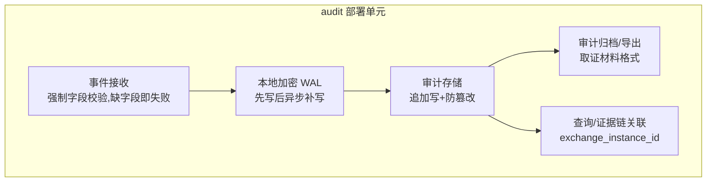

- 强制字段清单（event/asset/actor/action/policy/artifact/exchange）缺一即写失败。
- 防篡改：追加写 + 哈希链/签名归档；导出件须可作安全取证材料（PoC #2 验收点）。
- 为三期落湖预留血缘要素：`content_hash + exchange_instance_id + schema 声明位`。

### 3.6 release（制品版本·发布·回滚）

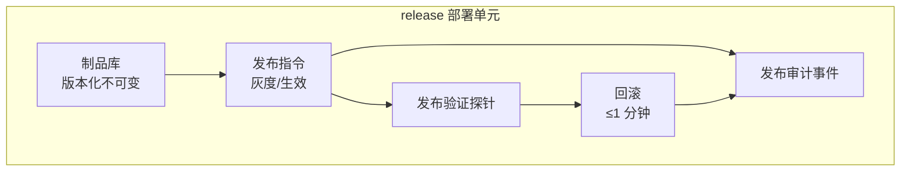

- 一次变更 ≤5 分钟生效、≤1 分钟回滚、全程可审计（验收第 4 条）。

### 3.7 sdk + selfcheck（接入工具链）

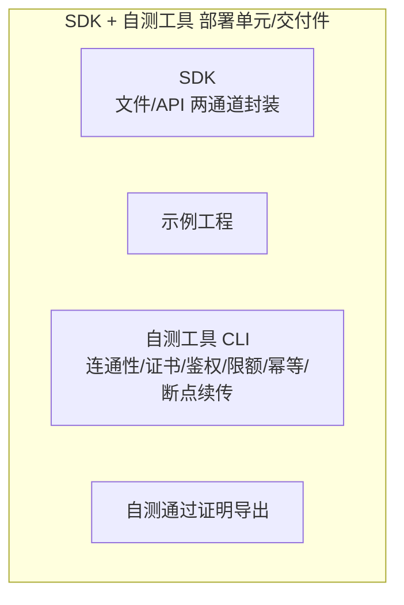

- 与 exchange 同批交付（工具链依赖顺序第 1 位）；目标是接入方自助定位 ≥80% 问题；缺任一项即不得承诺标准接入人天。

---

## 4. 关键链路时序

### 4.1 跨网文件交换主链路

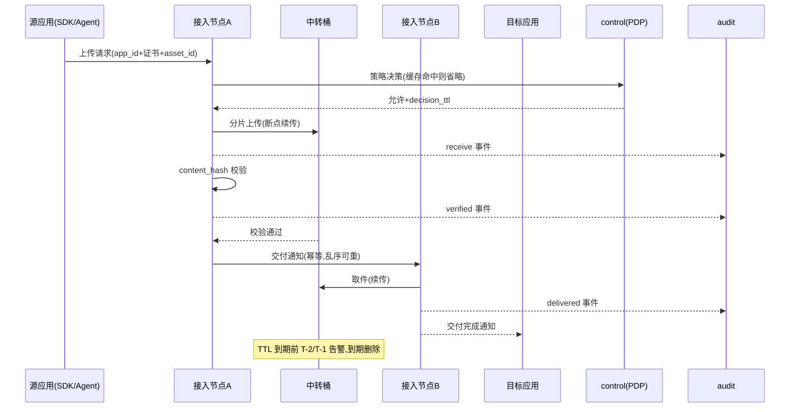

### 4.2 申请—审批—授权—回收

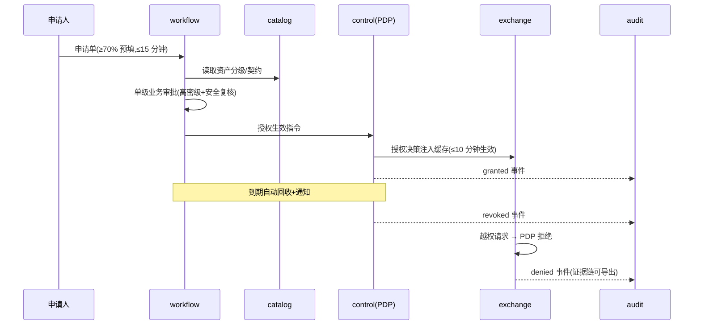

### 4.3 发布与回滚

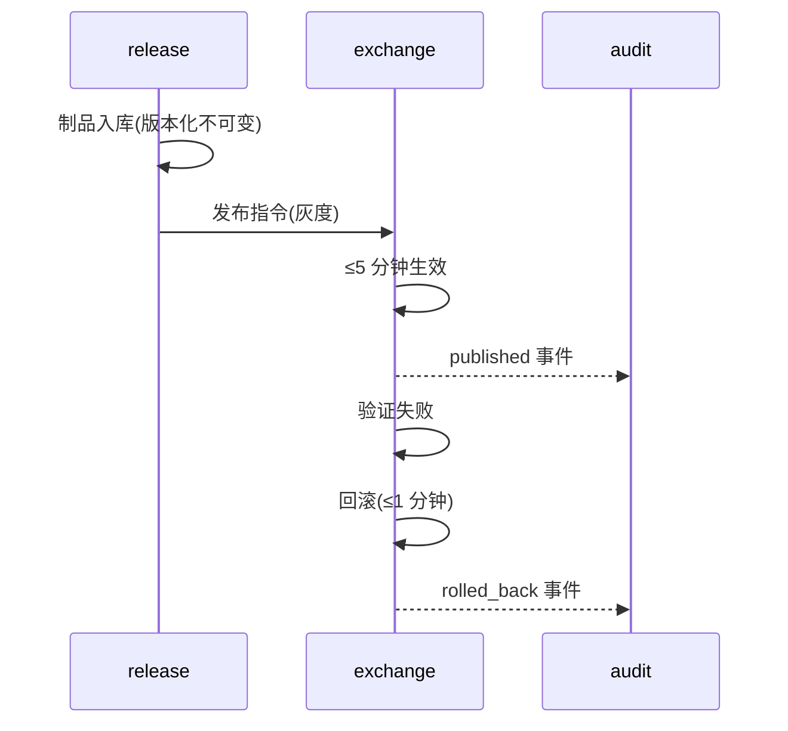

---

## 5. 技术选型

> 原则：**可私有化部署、无强制外网依赖、金融行业可审计、强监管网络管制下可交付**。所有组件均有备选，避免单一开源依赖卡交付。

| 技术领域 | 一期选择 | 选型理由 | 风险与对策 | 备选方案 |
|---|---|---|---|---|
| 应用语言/框架 | **JDK 25（LTS，2025-09 发布）+ Spring Boot（3.5+/4.x，PoC 期锁定兼容版本）** | 宋哥拍板；JDK 25 为 LTS，长期免费安全更新（至 2031+），虚拟线程/模式匹配等特性可简化并发与状态机代码；模块间仅 HTTP+事件耦合，技术栈统一降低交付风险 | Spring Boot 对 JDK 25 的正式支持需在 PoC 首周锁定具体小版本；对策：统一基线 JDK 25，Spring Boot 选取明确声明支持 25 的版本（3.5.x 起/4.x），国密库兼容性同步验证 | Go（exchange 单独）；若某客户强制旧基线再降 JDK 21（同为 LTS） |
| 代码/制品管理 | **GitHub（私有仓库）+ 私有 Nexus 制品仓** | 宋哥拍板；GitHub 协作/评审/CI 生态成熟，与 AI 编程工作流配合好；制品仍走私有 Nexus（内网拉取，release 版本化不受影响） | 银行强监管对源码外网托管敏感；对策：源码可镜像/出码包交付客户内网 Git（保留 release 出码包流程），默认私有仓 + 最小权限 + 已启用分支保护 | 客户强制内网时：镜像仓库（Gitea/GitLab 自托管），CI 双通道可配 |
| 服务间通信 | mTLS + 版本化 REST + 幂等事件 | 强监管下 Kafka 等消息集群不一定获准；事件+WAL+补偿拉取更可控 | 事件可能丢失；对策：发送方本地 WAL，接收方幂等消费+补偿拉取 | Kafka（二期扩容备选，需网络管制评审） |
| 控制面存储 | **MySQL 8.4 LTS（每单元独立实例）** | 宋哥拍板：开源 MySQL 较新 LTS；8.4 为当前最新 LTS（2024-04 发布、支持至 2032；9.x 为 Innovation 非 LTS 不选用）；开源生态与运维人才最广；单元独立实例满足"不共享库表"约束 | 单点 → 主备半同步+归档；基线统一 utf8mb4、事务隔离与审计插件口径；对策：审计/时区/大小写敏感细节在 PoC 期固化 | MariaDB；国产化要求时 openGauss/GaussDB |
| 中转桶（数据面唯一落盘） | 私有化对象存储（MinIO/S3 兼容） | 分片/续传/限速能力强，天然适配"接收—暂存—交付—删除" | 需客户允许私有对象存储入网；对策：PoC 期间会签网络管制开放节奏 | 自管 NFS+自定义分片（性能下降，仅管制限制时用） |
| 审计存储 | **MySQL 8.4 LTS(热)+归档对象存储(冷)+哈希链** | 追加写防篡改，导出件可作取证材料；先行 WAL（本模块独立，非 MySQL binlog）保证不丢 | 审计洪峰；对策：异步补写+按密级分叉（Boss 判决 B）；热库独立实例与业务库隔离 | 时序库/TDengine（二期报表需求出现时评估） |
| 应用网关 | 无独立网关；管理面轻量入口 + exchange 承担数据面职责 | 减少组件数，符合"exchange 唯一接触业务字节" | 管理面与数据面混用风险；对策：管理面路由与 exchange 网络隔离 | 独立 API 网关（二期，若审计合规评审要求） |
| 证书与加密 | mTLS，内置 CA，预留国密 SM2/SM3/SM4 | 鉴权透传双通道基础；国密口径 PoC 期间与安全部会签 | 客户要求国密时算法切换成本；对策：加密抽象层，证书双向可换 | 对接客户既有 CA |
| 部署形态 | 私有云 K8s（管控环境）/ 物理机 systemd（严格管制环境）双模板 | 兼容不同银行网络管控水平；两套模板都默认关闭 break-glass | 交付形态依赖客户环境；对策：接入文档写清两种模板验收口径 | docker-compose（过渡） |
| 自测工具 | 独立 CLI（Java/Go 单文件） | 接入方自助定位 ≥80% 问题，导出"自测通过证明" | 覆盖面不足→人天承诺失效；对策：闸门与人天承诺绑定 | Web 版自测台（二期） |
| 前端控制台 | **Vue3 + TypeScript + Tailwind CSS 4，以 AI 编程为主** | 宋哥拍板：管理面是填单/审批/表格/监控类低复杂度 UI，Tailwind 原子化 + AI 编程（Claude Code/Cursor 等）产出效率最高；纯静态产物+后端 API，内网部署不受影响 | AI 生成代码质量不稳定；对策：内部组件规范+代码评审门禁，核心审批/授权/发布链路仍人工 review，AI 只进 UI 代码不进决策链 | React + Tailwind（客户既有技术栈时切换） |

**技术选型与基线的硬约束对照**：

| 基线约束 | 技术落地 |
|---|---|
| 模块间不共享库表 | 每单元独立 MySQL 实例 + 独立审计链路 |
| exchange 可独立扩缩/发布 | 数据面与 CP/AP 仅靠缓存决策+事件耦合 |
| 审计缺字段即写失败 | audit 事件接收做强制字段 schema 校验 |
| 授权生效 ≤10 分钟 | PDP 决策写入 exchange 缓存，TTL 化 |
| 一次变更 ≤5 分钟生效/≤1 分钟回滚 | release 状态机 + 制品不可变版本化 |
| 到期自动回收 | workflow 定时扫描授权有效期，发回收事件 |
| sink 默认关闭、无旁路 | sink 仅接口契约，管理面无开启入口 |

---

## 6. 关键技术决策的架构落点

1. **Boss 判决 B（审计分叉）**：audit 事件接收 → 本地加密 WAL → 异步补写；WAL 触顶时按资产密级分叉：低密级只读可配置 fail-open（记异常+强告警），中高密级与写操作 fail-closed。落点在 exchange 的审计前置校验与 audit 的 WAL 层。
2. **Boss 判决 A（actor）**：默认权威主体=应用（`source_ip+证书+app_id`）；自然人可选头透传；`human_actor_required` 高密级强制，PDP 决策前校验，缺失即拒绝并出拒绝审计事件。
3. **Boss 判决 B（适配器）**：SPI 只定签名/生命周期/错误码/幂等/审计回调，实现走实施或客户自研，独立估算（私有协议 15–25 人天档外置）。
4. **Boss 判决 C（break-glass）**：代码配置与部署模板默认关闭、不在管理界面出现；启用需客户显式配置+风险确认+双人审批+范围/有效期+强告警+事后审计补录；不是自动 fail-open，不计入 license 承诺。
5. **L1–L4 分级降级**：L1 决策缓存 → L2 审计 WAL/分叉 → L3 无状态多实例+VIP 摘除 → L4 人工 break-glass，任何一层都不允许自动直通源系统。

---

## 7. 二/三期扩展预留点（本期只留缝，不落实现）

| 预留点 | 现在落什么 | 三期启用什么 |
|---|---|---|
| 事件与元数据契约 | 强制审计字段含血缘要素（`content_hash`/`exchange_instance_id`/`schema` 声明位） | 落湖/数据湖接入无需改审计链路 |
| sink 接口契约 | 只定签名、默认关闭、无旁路 | 统一审批路径下的落湖实现（另单） |
| 作业实例模型壳 | 全量状态/触发源枚举落库 | 调度集群启用异步/同步执行，不破坏实例键 |
| 协议适配器 SPI | 签名/生命周期/错误码/幂等/审计回调 | 实施方/客户自研适配器接入 |
| 五类能力分权模型 | 发现/申请/调用/看全量/再分发 | 行业配置包、跨组织共享引用同一模型 |

---

## 8. 待模块细化详设时消除的开放项

1. **SDK 模式人天 4–6 与验收 ≤5 人的数字冲突**：建议在详设中把 SDK 模式目标压到 4–5 人天，或明确列为"特殊路径单列"（当前基线暂按后者处理）。
2. **break-glass 客户风险确认流程**是否写入部署/交付模板措辞。
3. **适配器对外统一说法**是否进一步写死到交付文档措辞。
4. **审计冷归档的保留周期与合规要求**需在审计模块详设时与安全部会签。